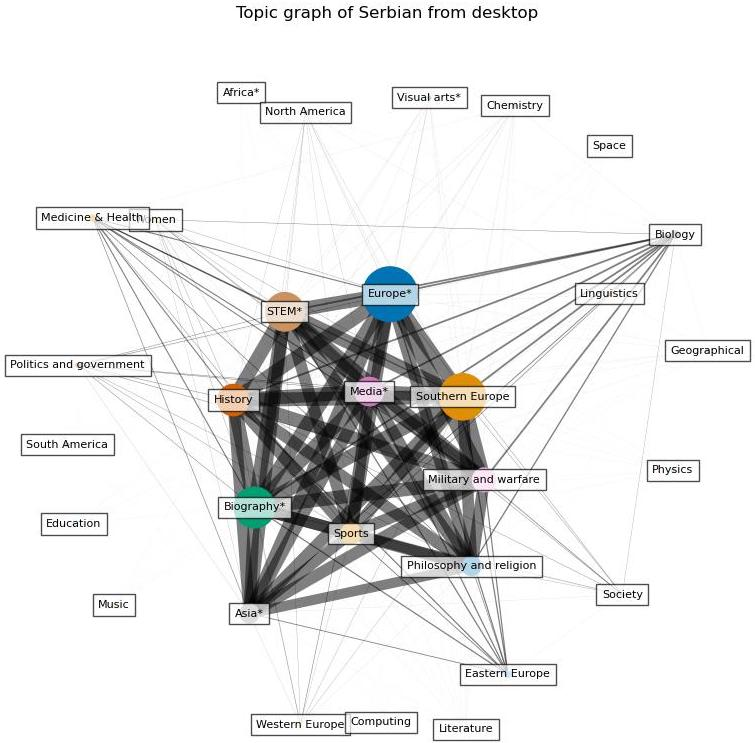
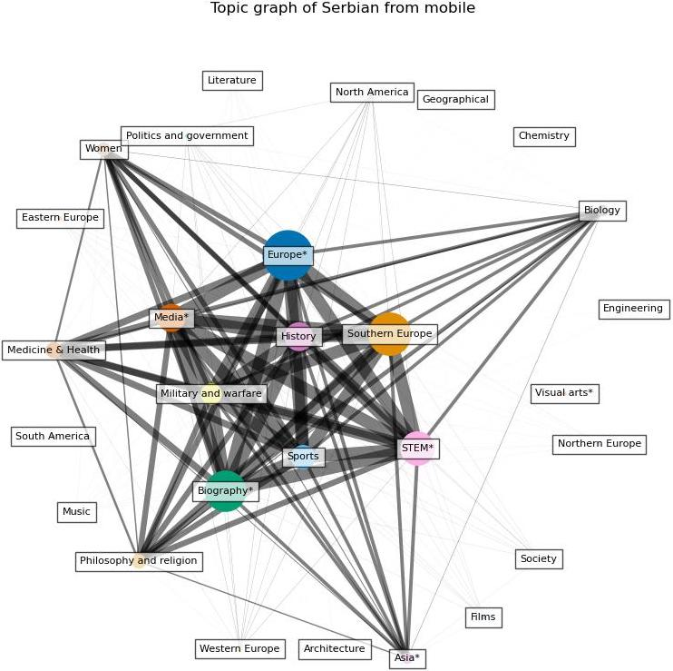
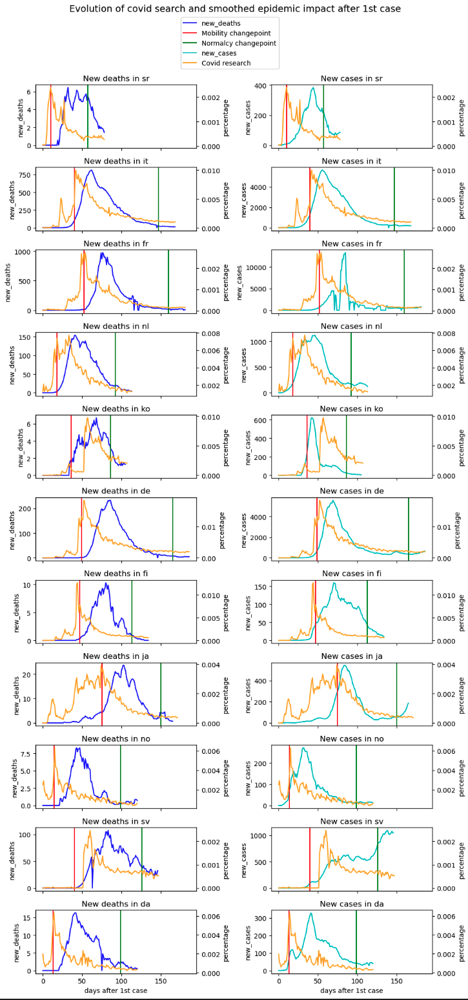
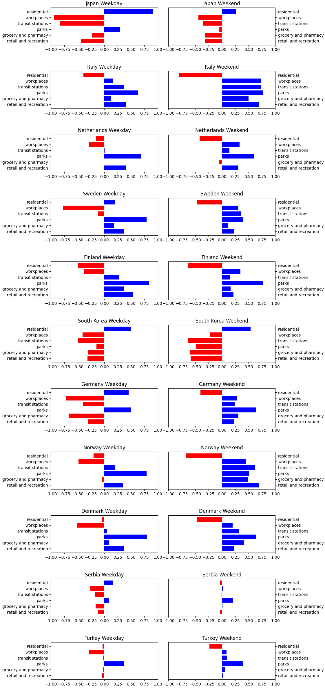
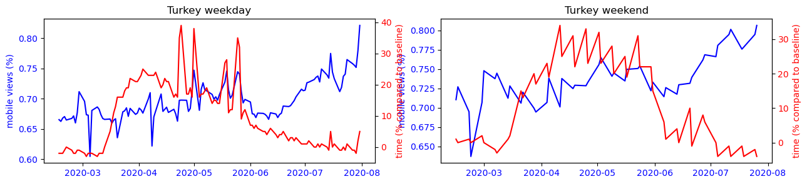
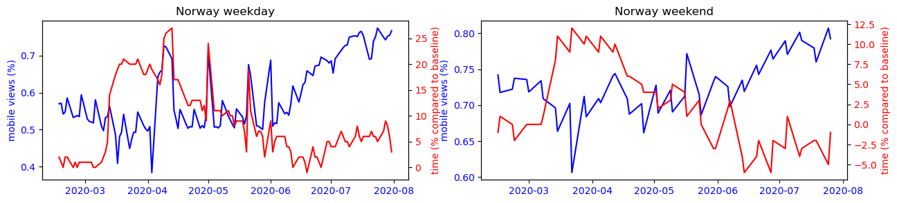
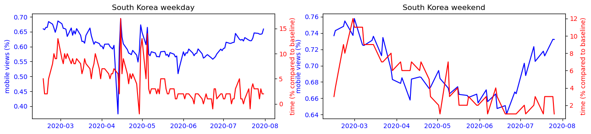

With the popularity of different smart devices, people perform more and more online activities. This makes it possible for us to analyze and understand people's preference through their online behaviour. One of the data source that is of interest is the Wikipedia search data. As the largest online enclopedia, Wikipedia contains huge amount of information regrarding people's interest for different topics. By taking a thorough analysis over Wikipedia search data, we are able to identify people's search pattern as well as how it is changed by some major events.

The first question we want to answer by analyzing Wikipedia search data is how people's search behavior changes on different type of devices. We may intuitively assume that people search for different topics on desktop and mobile device due to the different use case scenarios, but how do they differ? What are the topics that can explain the difference? Are the topics that explain the most difference the same across different regions? The answers to these questions can help us understand people’s different searching patterns under a more concrete context and confirm our expectation at the first place in a rigorous way by modeling and testing. This also has the potential of helping some companies adjust advertising or service strategy for different target customer groups, for example, for the customers that use different devices, to make the business thrive. With the page-views data from different device from Wikipedia, we investigate on the difference of search pattern between desktop and mobile, from volumetric level to topic-wise level.

The second question we want to investigate on is about how COVID change people's search pattern. As one of the most magnificent public heath events occurring in the era of social medial, COVID crisis has changed the way we work, exchange and inform ourselves by using new technologies to adapt to health emergency. These changes seem to have a long term impact on our societies (teleworking, online replay of courses…).Understanding how people search differently before and after Covid can help us better estimate its influence in other fields. 

This study aims to better understand how people’s online behavior differs by device type, location, and covid-related news. Combined with mobility data, we can also identify the relationship between mobility and mobile device usage. This helps us better understand what influences people’s choice of the device.
## Part 1 - How does people search differently when using desktop and mobile device?

<!-- The covid crisis has caused a change in our habits and ways of consuming multimedia content. We are going to study this impact by country, observing if the consequences of covid have accelerated this phenomenon or not and what are the stakes. To do so, we will study which devices are the most used and for what purpose? 

First of all, to be able to observe the impact of covid on our habits, it is important to observe the trends before these events, for that we are going to study the evolution of people's habits before the arrival of the covid events between January 2018 and January 2020 (MODIFY LIMIT ON THE GRAPH BELOW) -->
We begin the analysis by first taking a look at how Wikipedia search differs from mobile and desktop device on a volumetric-wise level. The follwing figure shows that people have an overall preference in using mobile device than desktop. 
<!-- No matter the country, the mobile device such as smartphone is the main tool for Wikipedia searches, and even if the desktop still represents a significant part of the consultations, it loses more and more its interest with time. This observation is consistent with the observation that smartphones are used more and more intensively over time, while desktop are more often associated with more serious work-related tasks. -->

 

We also notice that there are perodical spikes in the plots. Why do thoses perodical spikes occur? One possibility might be the result from  people's different routines during the weekdays and on weekends. To verify this, we next plot the pageviews from desktop device during weekdays and on weekend by different colors to see if there is consistent difference between them.

 

This observation allows us to conclude that people do use desktop device more on weekdays than on weekends. This is reasonable because people use more desktop during weekdays when working.
<!-- before the covid period and the travel restrictions, the smartphone was the most used device and tended to stand out more and more especially on weekends where we can imagine that people do not work and therefore use less the desktop which is a more professional device than the smartphone which is available everywhere with us especially on weekends when we are not in the office. -->

The next thing we want to investigate on is how covid changes the above identified trend. To carry out this analysis, we excerpt the data from 31/07/2019 and 31/07/2020. This is a timeline that covers both before and after covid time period. We then visualize the proportation of pageview volumns from different devices as shown before. To be more precise, we also add the time points of different interventions.

 

The first observation is that the impact of covid differs from country to country, which is explained by the fact that the measures taken against covid are also very different from country to country. We also observe that after the return to normalcy, the mobile usage ratio returns to its pre-crisis level, despite downward fluctuations during the covid events. This means that the long-term covid events have no impact on people's device use.

We have studied device usage preferences over time, but what about the content viewed and are there topics that are more viewed on one device than another? The next analysis is a more detailed investigation on the difference from mobile and desktop device on a topic-wise level.

## Prevalent topics from desktop and mobile device
Before conducting quantative analysis, we first do a qualitive analysis on the difference of prevant topics between the two types of devices by visualizing what are the topics that are searched more than others from desktop and mobile device respectively. To do this, we first build a bipartite graph in which one set of the nodes include the topics and the other includes the data. For the topic set, we only inlcude topics that is among the top 10 most searched topics in at least one day. Then, we project the graph to the topic set. In the projected graph, the size of the node represents its prevalence, which is calcuated by suming up the percent of the search of topic each day, while the width of the edge represents the frequency that the two topics appear together in the top 10 topics. The wider the edge, the more frequent the two topics appear together.

The following figures give an example of the result from Serbian. As explained before, the width of the edges indicate the frequency of the connected two topics appear together in the top 10 search topics, and the size of the topic represents an overall search percentage. We can see that the topics with the highest search percent are also the most connected, which indicates there is a consistency of the top search topics everyday. By inspecting the graphs for all languages, we find that this trend exists in all of them. Regarding the topics, we find that people in all the language regions are interested in topics related to Europe, STEM, and sports.

  
   

## A first glance into the difference regrading topics
After inspecting the data from volumetric level and investigating the prevalent topics from these two types of device, the next analysis we carry out is about the difference between desktop and mobile devices on topicwise level. For this part, we do the analysis by doing visualization and contextual analysis based on common sense. The next figure is a example from Serbian, it shows the difference of the percentage of each topic searched from mobile and desktop from one day.

 

We can observe that most of the topics are as well consulted on mobile as on desktop except some particular topics like STEM much more consulted on desktop, and biography much more consulted on mobile. These observations confirm the fact that the mobile is used for topics related to leisure activities while the desktop is preferred for more complex information searches. The mobile remains the preferred tool for casual scenarios, while the desktop is more often used in a more complicated and serious work environment. Finally, we can also note the fact that video games are more often consulted on desktop, this is due to the fact that the game experience is more adapted to desktop and that some games are only available on desktop. After inspecting the result for all the languages, we find that people do search for more serious and complicated information such as technology, software, and computing when using desktop while when using mobile application, there is more search in health, food, and fashion.

Till now, we only do the analysis based on visualization of the data from one day or very limited number of days. We get some intuitive results about the difference of searching pattern from desktop and mobile device but we cannot yet say if it is significant or not. So next, we do statistical test on the difference of percentage of pageviews from desktop and mobile device. The test is carried out for each language and topic.

## Does the statistic test confirm the difference?
Before doing the test, we get the boxplot of the gap of pageview percentage of each topic from the two types of devices. The follwing figure is an example of the result from Serbian. But again, after inspecting the result for all languages, we have some general findings. We notice that for most of the topics, the difference is distributed around zero. But for technology and STEM.STEM, the pageview percentage from desktop is almost always higher in all languages and for biography always lower.
 

We further analyze the difference in a more rigorous way by carrying out paired t test. In the statistic test, the tested two series are the percentage of one topic from desktop and mobile from 01/01/2018 to 31/07/2020 (except for swedish). We do the statistic test for all the topics to see for which topics the difference is significant with a significant level of 0.05. From the result of the test, we find that all of the 12 languages have more than 60 siginificant topics, which means the difference between the pageview percent from desktop and mobile device is significant for over 60 topics. This indicates a significant difference of people's search pattern from the two type of devices.

If we regard the vector of percentage of each topic from one day as a data point, and the device as a label, one straightforward way to viualize the difference is by ploting the data points from the two devices on the same plan. Since the data point has too high dimension (65), we first do PCA on the data with 2 principle components and plot the result on the plan of these two directions. The figure shows the result of Serbian. We can clearly see two clusters and the data is separatable.

By analyzing the topics that explain the most of the variance after doing PCA for all the language regions, we find that the main topics in which these two type of devices differ are Biography, Sports, STEM, and Techonology. This is very similar to the results we get from the above statistic test part where we find Biography, sports are searched more on mobile while STEM and Technology more on desktop in all language regions.

 

## Evidence from machine learning
As we see from the result of PCA that the two classes of data pints seem to be separatable, we want to further confirm how well we can separate them by training classifier on the data. We try three different classifier on the dataset: logistic regression, random forest, and xgboost. The training and testing are done separately for different language regions. This has the same idea with observational studies, if the data points are from the same language region, there is higher probability that the two classes have similar observed and unoberved covariates.

The result of the parameter tuning and model selection shows that all of the three models have high accuracy, prcision, and recall rate regarding classifying mobile and desktop by percentage of topics views. This further confirms the separability of the data points thus indicating a siginificant different of the percentage of the topics from desktop and mobile device. We also conduct interpretable analysis for the classifiers to see what are the topcis that explain most of the difference, and the result of the analysis also shows that Software, Computing, STEM, and Biography are among the features that contribute to the classification models the most. In a word, we get consistent results from visualization, statistic test, and machine learning models.

We could observe the search habits of people according to the device they use, and the difference on different devices is similar across the regions as we have seen. This is due to the fact that human have an overall similar working-leisure habits. However, people's reaction to the big events highly depends on their mindset, which is cultural so can be very different across regions. That's why we are going to do the next study on the reactions of the different populations to the covid crisis, for that we are going to study if the types of wikipedia searches vary before and after the period of crisis crossed for each country. 
## Part 2 - How does people in different region react differently to Covid?

In different regions, people have also been varying responses to government-imposed lockdowns and other measures to control the spread of the virus. Some people may support these measures, while others may resist them due to concerns about the economic impact or their own personal freedoms. Overall, the way that people in different regions react to Covid-19 can be complex and multifaceted, influenced by a range of factors such as cultural values, access to information and resources, and the effectiveness of government responses.

For this we have isolated all Wikipedia topics related to covid, and we will now investigate if there is a link for each country between covid-related events (number of cases and deaths, measures taken in the country) and covid-related searches. The beginning of each time series is setting to the day of the first case in the country representating the language.  

 

In most of cases, the maximum researches intensity is on the mobility changepoint. In Italy, covid searches percentage curve follows the same trend as number of deaths per days. But for France, trends are delayed. That's due to the fact that French people reacted at the same time as their Italian neighbours because the news are shared in media.

## Are people sensitive to the communication of the number of deaths or of new cases ?

To answer this question, it is necessary to introduce a method to compare two time series : Dynamic Time Warping (DTW).

It is an algorithm that is used to measure the similarity between two sequences, regardless of their length or timing. It is often used in speech recognition and music analysis, but it can also be applied to other types of data that vary over time, in this case : covid searches and deaths/new cases covid data. 

The basic idea behind DTW is to align two sequences in a way that minimizes the cumulative distance between them. DTW is useful in situations where the time intervals between events in the two sequences are not necessarily the same, or where the sequences may have different lengths. It allows for the comparison of sequences that may have been recorded at different times or at different rates, and can be used to identify patterns or trends that may not be apparent when looking at the sequences individually.

 

The similarity between cases and researches is always more intense that the one between deaths and researches. It means that the way to count cases is very important because it could bias reaction of people on their research about covid. On the plot, countries from Western Europe are more sensitive than others (France, Germany, Italy) and they have pretty the same reaction because the covid spreads almost at the same time on their population. Norway and Finland are more moderate, the relation between number of declared cases and covid research on wikipedia is less intense. But again there is a geographical link.

## Does there remain a long-term effect after the return to calm ?

When analyzing the distribution of Covid-19 data, it can be useful to use milestones as a way to compare the data over time or between different groups. For example, a milestone could be a changepoint in restrictions. Comparing the distribution of cases before and after a milestone can provide insight into the effectiveness of public health measures or the impact of other factors on the spread of the disease.

 

Here we can see that for example for Japanese, covid researches was already intense before the Mobility Changepoint. For Korean, they remain intense after the Normalcy Changepoint.

These different studies have allowed us to establish a link between the geographical location and the habits of the populations, although the reasons that explain it are still to be determined, we can already conclude that the habits of some populations like Europe are more influenced by the current events than for other populations like in Asia. 

We have studied the impact of the habit of searching on Wikipedia according to the device used, the country studied and the events it goes through. However the events related to the covid also had an impact on our travels through measures to minimize the spread of the virus. The objective of this last part is to use the covid events to study the correlation between the use of a device like the smartphone and the variation of mobility of the populations. 

## Part 3 - Is there any difference regarding the place people prefer to use mobile and desktop?

First, for each country, calculate the correlation coefficient between the mobile usage ratio using the Pearson correlation coefficient.

 

We can observe that for each country, the trends observed during the week intensify on weekends. However, the findings are different from country to country.
In Asian countries, the use of the smartphone is mostly correlated to its presence at home, this is the opposite trend that is observed in other countries of the world where precisely all places can have a more or less strong correlation with the use of the smartphone except the place of residence.

To make this observation more readable, we can observe on the figure below the strong correlation between the use of the cell phone and the time spent at home for countries like Japan or South Korea, while this observation is impossible to make for the other countries studied.

 
 
 
 
 
 
 
 
 
 
 

## Conclusion

