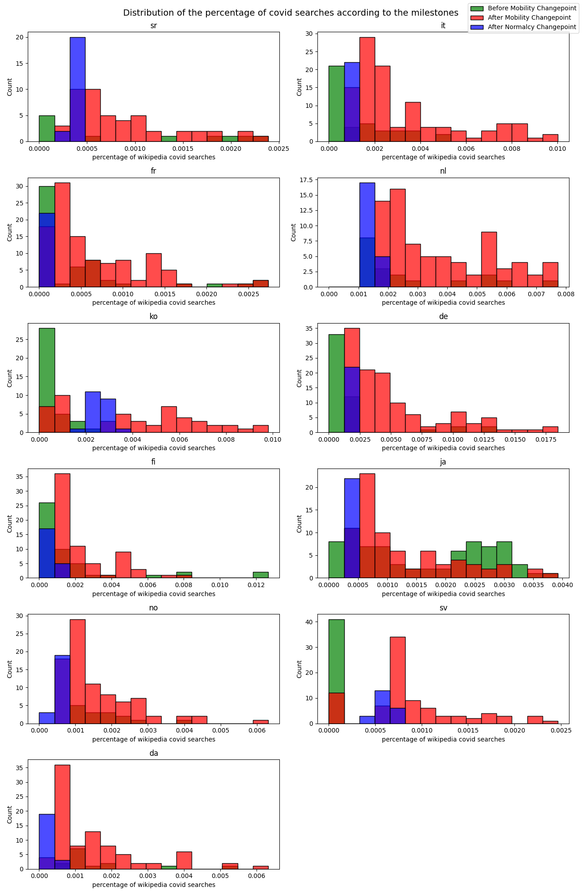

Generally, people are performing different activities when using desktop and mobile device for searching. Desktop device is more frequently used under working scenario while mobile device has a more flexible use case. With the page-views data from different device from Wikipedia, we investigate on the difference of search pattern between desktop and mobile, from volumetric level to topic-wise level.

The covid crisis has changed the way we work, exchange and inform ourselves by using new technologies to adapt to health emergency. These changes seem to have a long term impact on our societies (teleworking, online replay of courses…) but how do people search differently?

This study aims to better understand how people’s online behavior differs by device type, location, and covid-related news. Combined with mobility data, we can also identify the relationship between mobility and mobile device usage. This helps us better understand what influences people’s choice of the device.
## Part 1 - How does people behave differently when using desktop and mobile device?

The covid crisis has caused a change in our habits and ways of consuming multimedia content. We are going to study this impact by country, observing if the consequences of covid have accelerated this phenomenon or not and what are the stakes. To do so, we will study which devices are the most used and for what purpose? 

First of all, to be able to observe the impact of covid on our habits, it is important to observe the trends before these events, for that we are going to study the evolution of people's habits before the arrival of the covid events between January 2018 and January 2020 (MODIFY LIMIT ON THE GRAPH BELOW)

 

We can observe that no matter the country, the smartphone is the main tool for Wikipedia searches, and even if the desktop still represents a significant part of the consultations, it loses more and more its interest with time. This observation is consistent with the observation that smartphones are used more and more intensively over time, while desktop are more often associated with more serious work-related tasks 

We also notice that there are perodical spikes in the plots. This might be result from people's different routines during the weekdays and on weekends. To verify this, we plot the pageviews from desktop device during weekdays and on weekend by different colors.

 

This observation allows us to conclude that before the covid period and the travel restrictions, the smartphone was the most used device and tended to stand out more and more especially on weekends where we can imagine that people do not work and therefore use less the desktop which is a more professional device than the smartphone which is available everywhere with us especially on weekends when we are not in the office.

We will now look at the impact of covid on these trends by observing the same curves but this time with the influence of covid from January 2020. 

 

The first observation is that the impact of covid differs from country to country, which is explained by the fact that the measures taken against covid are also very different from country to country.
However, we observe that after the return to normalcy, the mobile usage ratio returns to its pre-crisis level, despite downward fluctuations during the covid events. This means that the long-term covid events had no impact on people's device use.

We have studied device usage preferences over time, but what about the content viewed and are there topics that are more viewed on one device than another? 

 
 

We can observe that most of the topics are as well consulted on mobile as on desktop except some particular topics like STEM much more consulted on desktop, and biography much more consulted on mobile. These observations confirm the fact that the mobile is used for topics related to culture while the desktop is preferred for more complex information searches. The mobile remains the preferred tool for casual scenarios, while the desktop is more often used in a more complicated and serious work environment. 
Finally, we can also note the fact that video games are more often consulted on desktop, this is due to the fact that the game experience is more adapted to desktop and that some games are only available on desktop.

We could observe the consumption habits of people according to the device they use, however these habits can vary from one country to another as we have seen. That's why we are going to study in more details the reactions of the different populations to the covid crisis, for that we are going to study if the types of wikipedia searches vary according to the period of crisis crossed for each country. 

## Part 2 - How does people in different region react differently to Covid?

For this we have isolated all Wikipedia topics related to covid, and we will now study the correlation for each country between covid-related events (number of cases and deaths, measures taken in the country) and covid-related searches.  

 

In most of cases, the maximum researches intensity is on the mobility changepoint. In Italy, covid researches percentage curve follows the same trend as number of deaths per days. But for France, trends are delayed. That's due to the fact that French people reacted at the same time as their Italian neighbours because the news are shared in media.

 

Here, we can see that the similarity between cases and researches is always more intense that the one between deaths and researches. It means that the way to count cases is very important because it could bias reaction of people on their research about covid. On the plot, we can see that countries from Western Europe are more sensitive than others (France, Germany, Italy) and they have pretty the same reaction because the covid spreads almost at the same time on their population. Norway and Finland are more moderate, the relation between number of declared cases and covid research on wikipedia is less intense. But again we found a geographical link.

 

Here we can see that for example for Japanese, covid researches was already intense before the Mobility Changepoint. For Korean, they remain intense after the Normalcy Changepoint.

These different studies have allowed us to establish a link between the geographical location and the habits of the populations, although the reasons that explain it are still to be determined, we can already conclude that the habits of some populations like Europe are more influenced by the current events than for other populations like in Asia. 

We have studied the impact of the habit of searching on Wikipedia according to the device used, the country studied and the events it goes through. However the events related to the covid also had an impact on our travels through measures to minimize the spread of the virus. The objective of this last part is to use the covid events to study the correlation between the use of a device like the smartphone and the variation of mobility of the populations. 

## Part 3 - Is there any difference regarding the place people prefer to use mobile and desktop?

First, for each country, calculate the correlation coefficient between the mobile usage ratio using the Pearson correlation coefficient.

 

We can observe that for each country, the trends observed during the week intensify on weekends. However, the findings are different from country to country.
In Asian countries, the use of the smartphone is mostly correlated to its presence at home, this is the opposite trend that is observed in other countries of the world where precisely all places can have a more or less strong correlation with the use of the smartphone except the place of residence.

To make this observation more readable, we can observe on the figure below the strong correlation between the use of the cell phone and the time spent at home for countries like Japan or South Korea, while this observation is impossible to make for the other countries studied.

 

## Conclusion

### About Us

blablabla

<object type="text/html" data="data/test.html" width="100%"></object>

## Note

 **some bold text**
*Italic text*

| A | B      |C |  |D |
|------------------|------------|----------------------| |------------------|
| A1 | B1 | C1             | | D1         |
| A2   | B2 | C2              | |D2      |
  

> "quote example"

